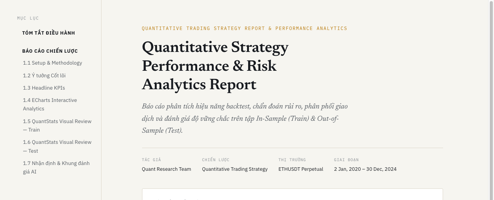
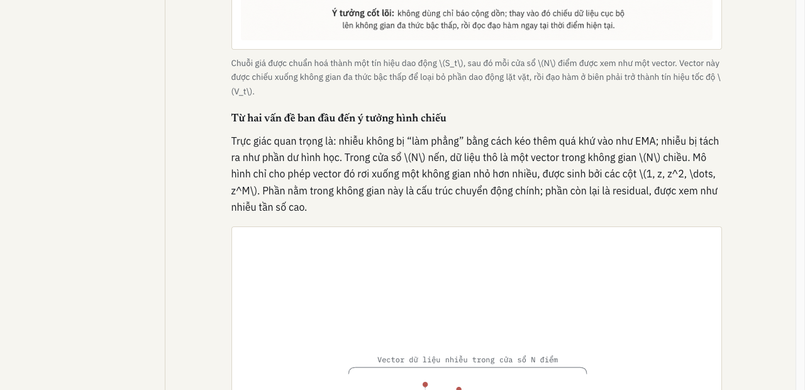
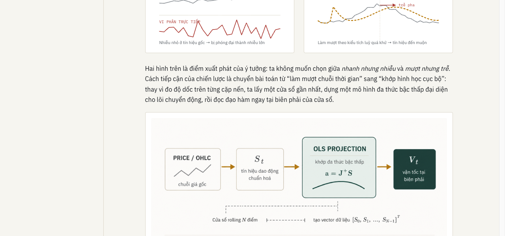
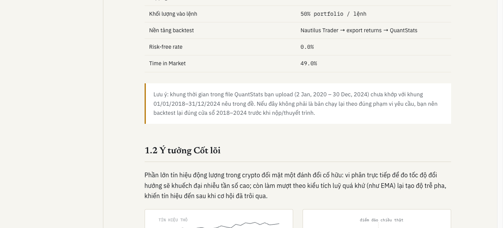
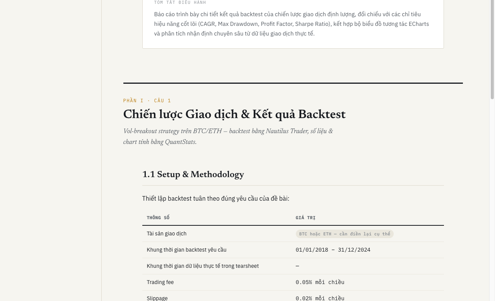

<div align="center">

# 📊 Quant Strategy Interpretation Platform

**An Open-Source Automated Engine for Quantitative Trading Strategy Reports & AI Interpretation**

[](https://python.org)
[](LICENSE)
[](https://echarts.apache.org)
[](https://aistudio.google.com)
[](https://pre-commit.com)

<p align="center">
  <a href="#-report-output-showcase">Output Showcase</a> •
  <a href="#-key-features">Key Features</a> •
  <a href="#-quick-start">Quick Start</a> •
  <a href="#-architecture">Architecture</a> •
  <a href="#-license">License</a>
</p>

<!-- HERO SHOWCASE: COVER OVERVIEW -->
<a href="assets/cover_overview.png">
  
</a>

</div>

---

## 💡 Why Quant Interpretation Platform?

When backtesting algorithmic trading strategies, raw Backtrader logs or standard QuantStats metrics are often difficult for non-technical stakeholders, peers, or fund investors to digest. 

This open-source platform automatically extracts raw backtest runs, generates **interactive TradingView-style Apache ECharts**, builds a **2-tier dual-set report (In-Sample & Out-of-Sample)**, and enriches the final output with **free AI model insights (Google Gemini / Groq)**.

---

## 📸 Report Output Showcase

### 1. Market Execution Price Action & Trade Signals Overlay
Interactive EChart displaying the continuous market price action with BUY (▲ green) and SELL (▼ red) fill markers mapped directly onto execution price levels, paired with interactive timeline zoom sliders.

<a href="assets/price_signal_overlay.png">
  
</a>

---

### 2. Standalone Equity Curve & Drawdown Waterfall
Elevated 520px high-resolution equity curve paired with an inverse red shaded drawdown waterfall (%) underneath for rapid risk inspection.

<a href="assets/standalone_equity.png">
  
</a>

---

### 3. Headline Target KPIs & Performance Badging
Automated threshold evaluation comparing CAGR, Max Drawdown, Profit Factor, and Sharpe Ratio against target benchmarks with visual badges (`✅ ĐẠT`, `⚠️ SÁT NGƯỠNG`, `❌ CHƯA ĐẠT`) and extended metric tables.

<a href="assets/kpi_badges.png">
  
</a>

---

### 4. Core Strategy Methodology & Signal Flowcharts
Collapsible technical breakdown detailing noise-smoothing principles, indicator formulations, and mathematical OLS projection flowcharts.

<a href="assets/core_thesis.png">
  
</a>

---

## ✨ Key Features

- 📈 **TradingView-Style ECharts Analytics**:
  - **Standalone Equity Curve**: 520px high equity curve with drawdown waterfall below.
  - **Continuous Price Action Overlay**: Execution price line with BUY (▲) and SELL (▼) fill markers and `dataZoom` timeline sliders.
  - **MAE / MFE Risk Distribution**: Maximum Adverse vs Favorable Excursion scatter plots.
  - **Account Margin Utilization**: Equity vs Free Margin over time from `account_report.csv`.
  - **Long vs Short Breakdown, 30-Trade Rolling Win Rate, Return Distribution, and 2D Density Heatmap**.

- 🛡️ **2-Tier Dual-Set Architecture (Train & Test)**:
  - **Tier 1 (Primary View)**: Always-expanded interactive ECharts suites generated from backtest data.
  - **Tier 2 (Secondary View)**: Full 12 QuantStats vector SVG charts enclosed in collapsible accordions (`<details class="qs-toggle">`).

- 🤖 **Free AI Qualitative Strategy Diagnosis**:
  - Zero-dependency REST adapter supporting **Google Gemini API** (`gemini-2.5-flash`) and **Groq API** (`llama-3.3-70b`).
  - Automatically loads keys from `.env` or `--api-key` CLI flag.
  - Generates Executive Summaries, Regime Vulnerability Diagnosis, and In-Sample vs Out-of-Sample Overfitting Ratings.

- 🎨 **Publication-Grade Paper Theme**:
  - Styled with classic typography (`Newsreader` serif, `IBM Plex Sans`, `IBM Plex Mono`) and dark paper palette (`#F6F5F0`, `#1C3D3A`, `#B8790A`).

---

## 🚀 Quick Start

### Prerequisites
- **Python 3.8+**
- Dependencies: `beautifulsoup4`, `lxml`, `pillow`, `pytest`

### 1. Installation

```bash
# Clone the repository
git clone https://github.com/BobbyAxerol/awesome-quant-interpretation.git
cd awesome-quant-interpretation

# Set up virtual environment
python3 -m venv .venv
source .venv/bin/activate

# Install package and development dependencies
pip install -e ".[dev]"
```

### 2. Environment Configuration (`.env`)

Copy `.env.example` to `.env` and add your free Google Gemini or Groq API key:

```bash
cp .env.example .env
```

Edit `.env`:
```env
GEMINI_API_KEY=your_google_gemini_api_key_here
GROQ_API_KEY=your_groq_api_key_here
```

### 3. Generate Strategy Report

Generate a report combining Train Set (In-Sample) and Test Set (Out-of-Sample) data:

```bash
python main.py \
    --train-dir data/report_ToTheMoon-Trainset \
    --test-dir data/report_ToTheMoon-Testnset \
    --out report_final.html \
    --sanity-check
```

Open `report_final.html` in your web browser!

---

## ⚙️ CLI Command Line Options

| Parameter | Required | Description |
| :--- | :---: | :--- |
| `--train-dir` | ❌ | Directory containing Train Set backtest outputs (`trade_log.csv`, `quantstats_daily.html`, etc.). |
| `--test-dir` | ❌ | Directory containing Test Set backtest outputs. |
| `--quantstats` | ❌ | Explicit path to Train Set QuantStats HTML file. |
| `--quantstats-test` | ❌ | Explicit path to Test Set QuantStats HTML file. |
| `--template` | ❌ | HTML template path (default: `template.html`). |
| `--out` | ❌ | Output report path (default: `report_final.html`). |
| `--api-key` | ❌ | Optional AI API key (Google Gemini or Groq). Reads from `.env` automatically if omitted. |
| `--sanity-check` | ❌ | Generates contact-sheet preview image (`report_final.html.sanity_check.png`). |

---

## 🏗️ Project Architecture

```
awesome-quant-interpretation/
├── quant_bot/                  # Core v2 Object-Oriented Package
│   ├── domain/                 # Domain models (Trade, Fill, EquityPoint, ReportDataset)
│   ├── extractors/             # HTML & CSV extractors (QuantStats, TradeLog, AccountHistory)
│   ├── analyzers/              # Performance & Trade Analyzers (badges, win rate, MAE/MFE)
│   ├── charts/                 # EChartsBuilder & SVG Chart Generators
│   ├── interpreters/           # AI Strategy Interpreter (Gemini / Groq) & Rule Interpreter
│   └── renderers/              # HTMLReportRenderer & SanityChecker
├── data/                       # Backtest dataset folders (Train & Test sets)
├── tests/                      # Pytest unit testing suite
├── assets/                     # README landing page marketing screenshots & assets
├── template.html               # Main report HTML paper theme template
├── main.py                     # Primary CLI entrypoint & .env loader
├── .env.example                # Template for environment configuration
└── pyproject.toml              # Package dependencies & configuration
```

---

## 🧪 Testing & Verification

Run the test suite via `pytest`:

```bash
.venv/bin/pytest
```

---

## 🤝 Contributing

Contributions are welcome! Feel free to open an issue or submit a Pull Request.

1. Fork the Project
2. Create your Feature Branch (`git checkout -b feature/AmazingFeature`)
3. Commit your Changes (`git commit -m 'feat: add AmazingFeature'`)
4. Push to the Branch (`git push origin feature/AmazingFeature`)
5. Open a Pull Request

---

## 📄 License

Distributed under the MIT License. See [`LICENSE`](LICENSE) for more information.

---

<div align="center">
  <sub>Built with ❤️ for Quantitative Researchers & Algorithmic Traders.</sub>
</div>
